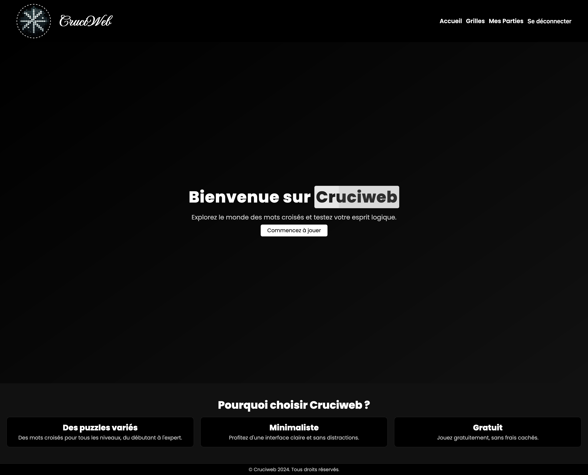
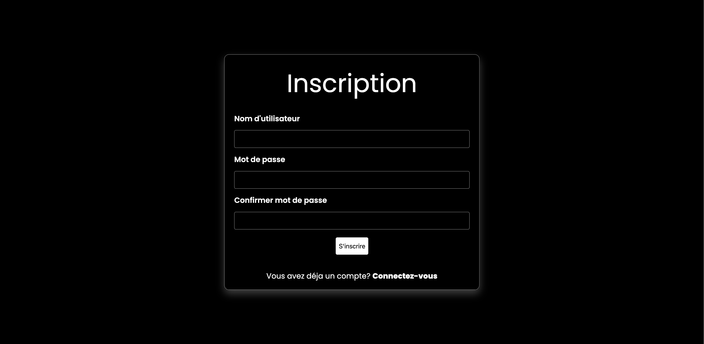
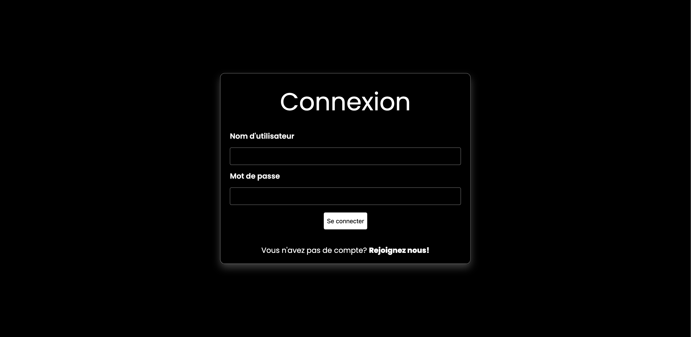
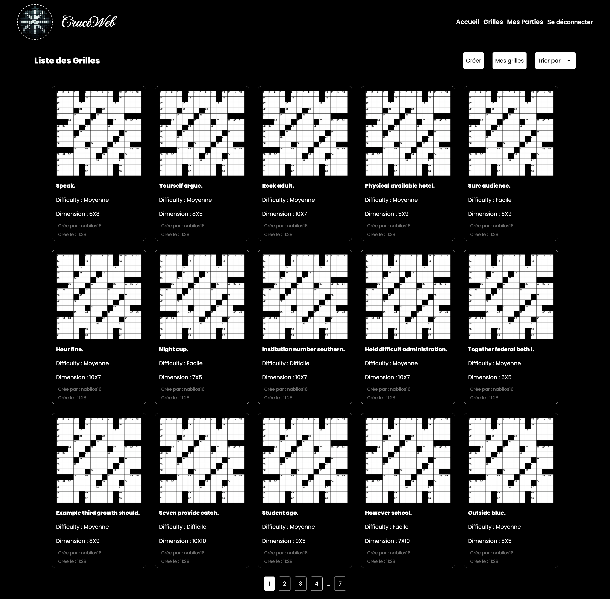
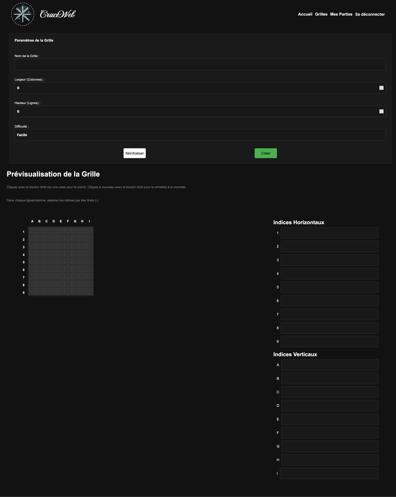
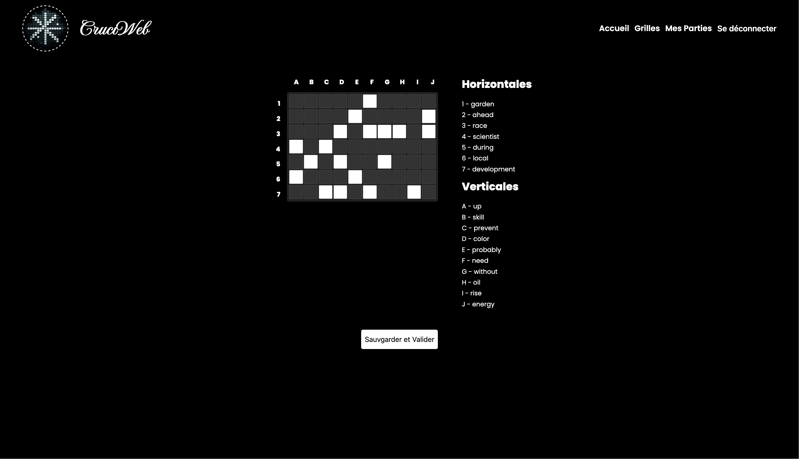
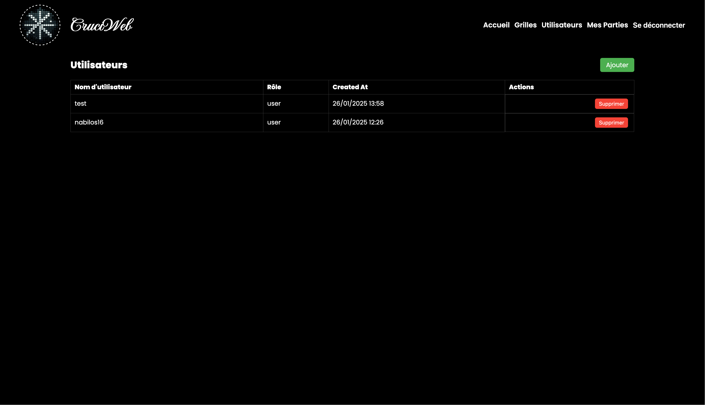

# Projet de Jeu de Mots Croisés

Ce projet est une application web développée en **Java EE** ou **Jakarta EE** avec **JPA** (Java Persistence API) qui permet aux utilisateurs de jouer à des jeux de mots croisés interactifs. L'application repose sur une architecture robuste et intègre un système de gestion des grilles, des indices et des parties. L'objectif principal est de fournir une expérience utilisateur simple et efficace, tout en garantissant la cohérence et l'intégrité des données dans la base.

## Fonctionnalités principales

- **Gestion des utilisateurs** :  
  Les utilisateurs peuvent s'inscrire, se connecter et accéder à leurs parties sauvegardées.
- **Création et gestion de grilles** :  
  Chaque utilisateur peut créer des grilles de mots croisés personnalisées avec des indices associés.
- **Système de parties (games)** :  
  Les joueurs peuvent jouer à des grilles existantes, sauvegarder leur progression et reprendre leurs parties à tout moment.
- **Suppression en cascade** :  
  Lorsque des utilisateurs ou des grilles sont supprimés, toutes les données associées (indices, parties, etc.) sont également supprimées automatiquement pour garantir la cohérence des données.

## Technologies utilisées

- **Backend** : Java EE, JPA, Hibernate
- **Base de données** : MySQL
- **Architecture** :  
  Modèle relationnel avec des entités pour `User`, `Grid`, `Clue` et `Game`.
- **Gestion des clés étrangères** :  
  Les relations entre les entités incluent des suppressions en cascade (via `ON DELETE CASCADE`).

## Objectif pédagogique

Ce projet a été conçu dans le cadre d'un exercice universitaire. Il met en pratique plusieurs concepts essentiels :

- Les bases de la persistance des données avec JPA.
- La gestion des relations entre entités dans une base relationnelle.
- La création et manipulation de données cohérentes pour tester et valider une application.
- L'utilisation des contraintes de base de données (`ON DELETE CASCADE`) pour gérer les dépendances entre tables.

# Guide de déploiement - Application Jakarta EE

## Prérequis

- Un serveur Tomcat installé et configuré
- Un serveur MySQL installé et configuré
- phpMyAdmin (optionnel)
- Une archive ROOT.war de l'application

## Instructions de déploiement

### Configuration générale

1. **Préparation de l'archive**

   - Téléchargez l'archive ROOT.war

2. **Configuration de la base de données**

   - Si ce n'est pas déjà fait, connectez-vous en tant que root MySQL
   - Créez un utilisateur avec les droits nécessaires
   - Créez une base de données pour le projet

3. **Déploiement sur Tomcat**

   - Accédez à l'interface Tomcat Manager : `http://<ip_serveur>:<port>/manager`
   - Authentifiez-vous avec vos identifiants Tomcat
   - Retirez l'application existante avec le path "/"
   - Dans la section "Fichier WAR à déployer"
     - Sélectionnez le fichier ROOT.war
     - Cliquez sur "Déployer"

4. **Configuration de la persistance**

   - Connectez-vous au serveur via SSH : `ssh <utilisateur>@<ip_serveur>`
   - Accédez aux droits root (via `sudo` ou `su -`)
   - Naviguez vers le fichier persistence.xml situé dans :
     `/var/lib/tomcat<version>/webapps/ROOT/WEB-INF/classes/META-INF/persistence.xml`
   - Modifiez le fichier avec votre éditeur préféré (vous pouvez utiliser nano ou vi selon vos préférences 😉)
   - - Exemple avec nano :
       `nano /var/lib/tomcat<version>/webapps/ROOT/WEB-INF/classes/META-INF/persistence.xml`

5. **Modification des propriétés de persistance**
   Modifiez les propriétés suivantes :

   ```xml
   <property name="jakarta.persistence.jdbc.url"
             value="jdbc:mysql://<addresse_db>:<port_db>/<db_name>"/>
   <property name="jakarta.persistence.jdbc.user"
             value="<db_user>"/>
   <property name="jakarta.persistence.jdbc.password"
             value="<db_password>"/>
   ```

6. **Finalisation**
   - Sauvegardez le fichier persistence.xml
   - Retournez à l'interface Tomcat Manager
   - Démarrez l'application (path "/")
7. **Accès à l'application**
   - Accédez à l'application via l'URL : `http://<ip_serveur>:<port>/`

### Configuration spécifique à la machine virtuelle fournie

**Adresses et ports :**

- Machine virtuelle : `192.168.76.76`
- Tomcat Manager : `http://192.168.76.76:8080/manager`
- phpMyAdmin : `http://192.168.76.76/phpmyadmin`
- Port MySQL : `3306`

**Identifiants :**

- SSH :
  - Utilisateur : `urouen`
  - Mot de passe : `madrillet`
- Root :
  - Mot de passe : `rotomagus`
- Tomcat Manager :
  - Utilisateur : `tomcat`
  - Mot de passe : `tomcat`
- Base de données :
  - Nom de la base : `projet`
  - Utilisateur : `projet`
  - Mot de passe : `tejorp`

**Configuration persistence.xml :**

```xml

<property name="jakarta.persistence.jdbc.url"
          value="jdbc:mysql://localhost:3306/projet"/>
<property name="jakarta.persistence.jdbc.user"
          value="projet"/>
<property name="jakarta.persistence.jdbc.password"
          value="tejorp"/>
```

**Accès à l'application :**
Accédez à l'application via l'URL : `http://192.168.76.76:8080/`

## Accès initial à l'application

Une fois le déploiement terminé, pour administrer l'application, vous pouvez vous connecter avec :

- Utilisateur : `admin`
- Mot de passe : `8?M6g$9d8G4(`

## Note importante

Les tables de la base de données ainsi que l'administrateur seront créées automatiquement lors du premier démarrage de
l'application.

## Illustrations de l'application

Voici quelques captures d'écran de l'application pour vous donner un aperçu de son interface et de ses fonctionnalités :

1. **Page d'accueil**
   

2. **Page d'inscription**
   

3. **Page de connexion**
   

4. **Page listant toutes les grilles**
   

5. **Page de création de grille de mot croisé**
   

6. **Page de la grille (partie)**
   

7. **Page de gestion d'utilisateur**
   
